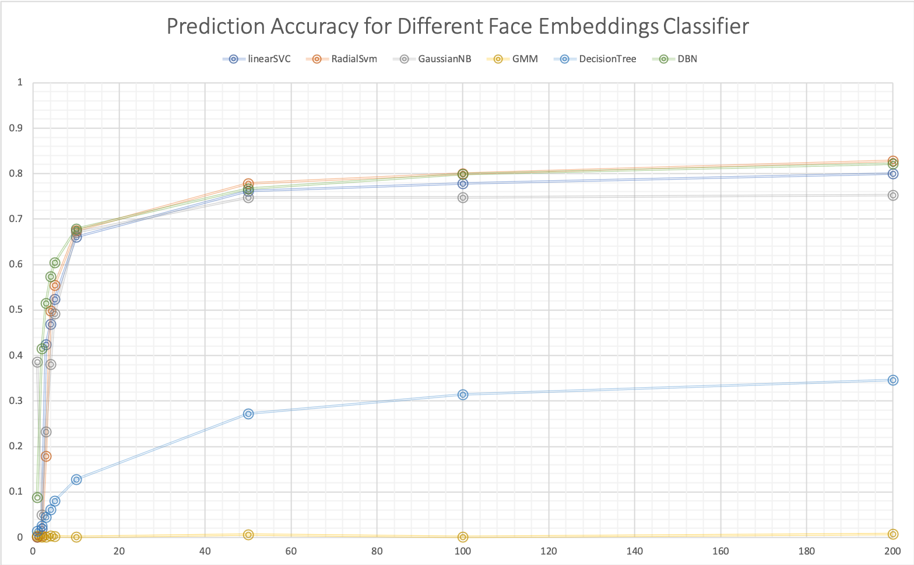
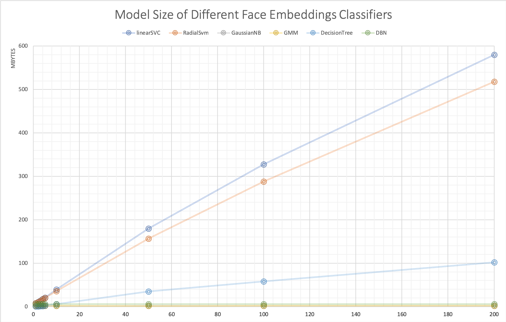

Openface Classifier Accuracy vs. Data Size
============================================

.. contents::

The repo link for this experiment is `https://github.com/HanFa/ClassifierAccuracy <https://github.com/HanFa/ClassifierAccuracy>`_.

Research Objectives
-----------------------------

* Study how well the different types of classifiers classify face embeddings, when given a different size of labeled face images
* Study how the size of embeddings and classifier change as the dataset increasing

Hypothesis
-----------------------------
* Accuracy of classification will increase until a saturation points as the data size increases
* The cross entropy loss will decrease as the data size increases
* The model size should remain constant (independent of the size of training set)

Experiment Details
---------------------

Dataset
~~~~~~~~~~
We use a **subset** of `VGGFace2 Test Images <http://www.robots.ox.ac.uk/~vgg/data/vgg_face2/>`_ which consists of 500 identities with 100 face images per identity on average. 296 out of these 500 identities are used because they have enough number of images (more than 205) for the training and testing.

Respectively, the face classifiers will be fit with {1, 2, 3, 4, 5, 10, 25, 50, 100, 200} image per person. Meanwhile, 5 exclusive images are extracted into the validation set for each identity.

Steps
~~~~~~~~~~~~~~~~
To reproduce the results, please refer to `run_experiment.sh <run_experiment.sh>`_. The first step is to align faces in the dataset.

.. code::

    # Preprocess: Align the faces for the dataset: ./data/images/raw
    function align_faces {
        ./util/align-dlib.py --dlibFacePredictor ./dlib/shape_predictor_68_face_landmarks.dat ./dataset/raw align \
        outerEyesAndNose ./dataset/align --size 96
    }

The second step is to extract embeddings from those aligned images.

.. code::

    # Generate representation for each dataset
    function generate_rep() {
        ./batch-represent/main.lua -model ./openface/nn4.small2.v1.t7 -outDir dataset/embeddings -data models/align
    }

The third step is to partition the embeddings. For each identity, split the embeddings into {1, 2, 3, 4, 5, 10, 25, 50, 100, 200} embeddings per identity. Also, it leaves out 5 images for each identity as the validation set.

.. code::

    # Split representations for train and test set
    function split_embeddings {
        python3 split_embeddings.py
    }

The fourth step is to fit classifiers with each training set. (Remember to change the type of classifier for ``--classifier`` arguments. Available choices are ``['linearSVC', 'RadialSvm', 'GaussianNB', 'GMM', 'DecisionTree', 'DBN']``) The classifier will be dumped as ``dataset/embeddings-{DATA_SIZE}/classifier.pkl``.

.. code::

    # Fit and dump the classifiers
    function fit_classifiers {
        for i in 1 2 3 4 5 10 25 50 100 200
        do
            python classifier.py --dlibFacePredictor dlib/shape_predictor_68_face_landmarks.dat --imgDim 96 \
            --networkModel openface/nn4.small2.v1.t7 train dataset/embeddings-$i --classifier linearSVC
        done
    }

The fifth step is to infer identities from the embeddings using the classifiers we trained. (Remember to change the type of classifier for ``--classifier`` arguments. Available choices are ``['linearSVC', 'RadialSvm', 'GaussianNB', 'GMM', 'DecisionTree', 'DBN']``) The script ``classifier.py`` is adapted from the `Openface Demo <http://cmusatyalab.github.io/openface/demo-3-classifier/>`_ and generates predictions in the directory `dataset/validation/ <dataset/validation/>`_ in the format ``predict_{CLASSIFIER_TYPE}-{DATA_SIZE}.csv``.

.. code::

    # Predict 
    function predict_validation {
        for i in 1 2 3 4 5 10 25 50 100 200
        do
            python classifier.py --dlibFacePredictor dlib/shape_predictor_68_face_landmarks.dat --imgDim 96 \
            --networkModel openface/nn4.small2.v1.t7 \
            infer --classifierModel ./dataset/embeddings-$i/classifier.pkl --embeddings_dir ./dataset/validation --result_name linearSVC-$i
        done
    }

The last step is to compare the validation ground truth label ``dataset/validation/labels.csv`` with ``predict_{CLASSIFIER_TYPE}-{DATA_SIZE}.csv``. The results of prediction accuracy and model size will be generate at project root.

.. code::

    python get_accuracy_modelsize.py

Results
-----------

All the results are archived in an Excel worksheet `results.xls <results.xls>`_.

Accuracy
~~~~~~~~~~~~~

``GMM`` and ``DecisionTree`` are not appropriate choices to classify face embeddings, as commented by Brandon Amos. ``linearSVC``, ``RadialSvm`` and ``DBN`` (Deep belief network) have similarly better performance.

As expected, the engagement of a new embedding sample points significantly improves the classifier's performance when we have few sample points. However, the prediction accuracy will reach a saturation point when the size of sample points is above 50.

Model Size
~~~~~~~~~~~~~

The size of classifiers (after pickling) has been measured. The Sklearn implementation of ``linearSVC``, ``DescisionTree`` and ``RadialSvm`` turns out to have a linearly increasing model size as the training embeddings number increases. (**Why?**) ``DBN``, ``GaussianNB`` and ``GMM`` has a fixed model size because of the fixed number of parameters predefined inside the model architecture.

Updates: Run on the whole VGGFace2 dataset
----------------------------------------------------

The previous part of this experiment builts a classifier upon 296 different identities (the subset of VGGFace2).

This expeirment is followed up with the **complete** VGGFace2 dataset with 8714 identities. After running ``python3 show_embeddings_stats.py``, it suggests:

.. code::

    8338 out of 8404 identities have face images more than 105
    7379 out of 8404 identities have face images more than 205
    6280 out of 8404 identities have face images more than 255

We choose to work with these 8338 identities with more than 105 face images in the dataset. For each time, 
the training cluster size (face number per identity) is [1,2,3,4,5,10,25,50,100] and we leave out 5 per identity for the validation.

Results
~~~~~~~~~~~~~

+---------------+----------------+----------------+----------------+----------------+----------------+----------------+----------------+----------------+----------------+
|  Accuracy     | 1              | 2              | 3              | 4              | 5              | 10             | 25             | 50             | 100            |
+---------------+----------------+----------------+----------------+----------------+----------------+----------------+----------------+----------------+----------------+
| LinearSVC     | 0.119908851043 | 0.189565843128 | 0.231446390022 | 0.259990405373 | 0.282513792276 | 0.340441352842 | 0.388006716239 | 0.415087550971 | 0.431734228832 |
+---------------+----------------+----------------+----------------+----------------+----------------+----------------+----------------+----------------+----------------+
| SVC(linear)   | running        | running        | running        | running        | running        | running        | running        | running        | running        |
+---------------+----------------+----------------+----------------+----------------+----------------+----------------+----------------+----------------+----------------+

+---------------+----------------+----------------+----------------+----------------+----------------+----------------+----------------+----------------+----------------+
|Model Size (MB)| 1              | 2              | 3              | 4              | 5              | 10             | 25             | 50             | 100            |
+---------------+----------------+----------------+----------------+----------------+----------------+----------------+----------------+----------------+----------------+
| LinearSVC     | 25531029       | 25531029       | 25626201       | 25641283       | 25651124       | 25684876       | 25715993       | 25735353       | 25761043       |
+---------------+----------------+----------------+----------------+----------------+----------------+----------------+----------------+----------------+----------------+
| SVC(linear)   | 5260488484     | 6908955519     | 8790882731     | 10762224678    | 1283741378     | 23544143809    | training       | training       | training       |
+---------------+----------------+----------------+----------------+----------------+----------------+----------------+----------------+----------------+----------------+

These results demostrate the difference in scalability between ``LinearSVC`` and ``SVC(kernel='linear')``. 
The ``SVC(kernel='linear')`` has worse scalability because of the linearly increasing model size as the training set increases. 
They vary in terms of model size from each other because of their different underlying implementation. I made a comparison shown as below:

